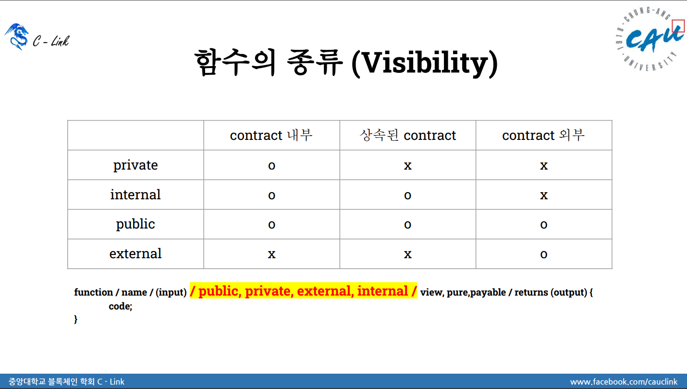

### Visibility



## 복습

# visibility는 가시성이라는 뜻이지만, 접근성으로 이해하면 쉬움!

- visibility.sol

  > 컨트랙트 내부 함수들 중에서 private, internal 접근해서 값 가져와보기!  
  > 밖에서 함수를 접근하지 못하게 막았는데, 나도 접근을 못한다면 어떻게 해야될까?  
  > public이면 다른사람도 접근 할 수 있기 때문에, require(owner == msg.sender, "back")로 체크하기!  
  > owner 체크는 여러 함수에서 사용 될 수도 있으면, modifier 사용하기.

  > 상속 된 컨트랙트 접근하는 방법.↓

  ```javascript
      // VISIBILITY_1 형 vs
      VISIBILITY_1 vs = new VISIBILITY_1();

      // 상속은, 상속된 컨트랙트의 함수명을 그대로 가져다 썼지만, 외부에서 접근할 때는 아래와 같이 접근.
      function publicF_o() public view returns(string memory) {
          return vs.publicF();
      }

      function externalF_o() public view returns(string memory) {
          return vs.externalF();
      }

      /* 아래 함수도 접근하지 못함.
      function internalF_o() public view returns(string memory) {
          return vs.internalF();
      }
      */
  ```

- visibility2.sol

  > VISIBILITY 컨트랙트에서 상태변수 값을 변경 후, 상속받은 Child 컨트랙트에서 값을 불러오면 왜 변경된 값을 불러오지 못하나?

- visibility3.sol

  > 복수로 상속받으려면 어떻게 작성해야 될까?  
  > 상속받은 컨트랙트의 함수명이 같으면 어떻게 타개해야 되나?  
  > → virtual / override

- visibility4.sol

  > 서로 다른 두 개의 상속을 받는데, 상속받는 두 함수의 함수명이 같을 경우, override를 해야 함.  
  > return 값의 형태를 맞춰야하고 / 누구를 override 할 건지 명확히 해야 함.

- visibility5.sol

  > 손자 컨트랙트에서 조상 컨트랙트의 함수를 가져다 쓸 수 있을까?

  ```javascript
    contract DAD {
      function who() virtual public pure returns(string memory) {
          return "dad from DAD";
      }
    }

    contract Child is DAD {
        function who() virtual override public pure returns(string memory) {
            return DAD.who();
        }
    }

    // 손자 컨트랙트에서 조상 즉, DAD 컨트랙트의 함수를 가져다 쓸 수 있나? -> 있음.
    // DAD를 상속받은 Child를 또 상속하기 때문에, Child에서의 함수명도 중복되면 virtual override 같이 사용
    contract GrandChild is Child {
        function who() override public pure returns(string memory) {
            return DAD.who();
        }
    }

  ```

- visibility6.sol

  > super 키워드는 무엇을 의미하고 언제 사용할까?  
  > Child2, Child3, Child4, Child5 컨트랙트의 각 리턴값을 알아보자.

- visibility_variable3.sol

  > 상속받았지만, 원본 컨트랙트가 변경 되었을 때, 값을 추적하지 못했음. 그럼 값을 추적 할 수 있게 해보자. (At address)
